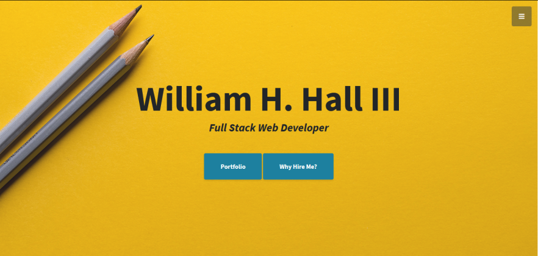

# Responsive Portfolio

This is my portfolio for full stack web development. I used a template to get it up and running quickly, and to demonstrate my ability to customize templates. 

## Preview

## Usage

This site is provided for potential employers to get to know me a little better, to ascertain whether I would be a good fit for their organization prior to a first interview. 

## Languages/Frameworks Used

html, css, javascript, fontawesome, bootstrap. Template provided by <a href="https://startbootstrap.com/">Start Bootstrap</a>

